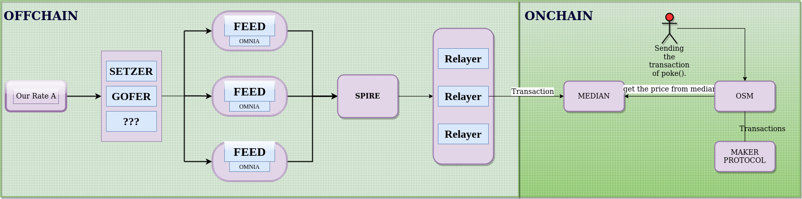

# **ORACLES**

## Architecture
Goals of this new architecture are:
<!-- 
1. Scalability,
2. Reduce costs by minimizing number of ethereum transactions and operations performed on-chain,
3. Increase reliability during periods of network congestion,
4. Reduce latency to react to price changes,
5. Make it easy to on-board price feeds for new collateral types, and
6. Make it easy to on-board new Oracles. -->


### Their Architecture

### Our Architecture

## Design Goals

#### The Oracle uses these services :
  
  1. Gofer
  2. Setzer
  3. Spire
  4. Omnia
  
  >Each of them are explained below

# GOFER 
>Gofer is a tool that provides reliable asset prices taken from various sources.

## Installation
>**##PREREQUISITE** It is recommended that you install Go version 1.18.1 on your system.:

    1 . git clone https://github.com/block360/oracle-suite.git

    2 . cd oracle-suite

    3 . RUN this export BUILD_DIR=`<Your bin path>` make; //like /usr/bin/ 

    **For running the the agent**:
    4 . gofer agent -c ./gofer.json --log.verbosity info
**NOTE** It will install both gofer and spire.
## Running the gofer 

> Gofer consists of two components that function like a client/server architecture: the gofer agent (server) and the gofer. The gofer agent should be running in order for the gofer to be able to pull prices from it.


    For getting the price from terminal:

    `gofer prices ETH/USD -c ./gofer.json --format trace`


## Sample config file gofer.json.


```json
{
  "ethereum": {
     "rpc": ["https://mainnet.infura.io/v3/de82b2d602264e4fbc0929dec0c45baa"]
  },
  "gofer": {
    "rpc": {
      "address": "127.0.0.1:8081"
    },
    "origins": {
      "balancerV2": {
        "type": "balancerV2",
        "name": "balancerV2",
        "params": {
          "symbolAliases": {
            "ETH": "WETH"
          },
          "contracts": {
            "WETH/GNO": "0xF4C0DD9B82DA36C07605df83c8a416F11724d88b",
            "Ref:RETH/WETH": "0xae78736Cd615f374D3085123A210448E74Fc6393",
            "RETH/WETH": "0x1E19CF2D73a72Ef1332C882F20534B6519Be0276",
            "STETH/WETH": "0x32296969ef14eb0c6d29669c550d4a0449130230",
            "WETH/YFI": "0x186084ff790c65088ba694df11758fae4943ee9e"
          }
        }
      },
      "bittrex": {
        "type": "bittrex",
        "name": "bittrex",
        "params": {
          "symbolAliases": {
            "REP": "REPV2"
          }
        }
      },
      "curve": {
        "type": "curve",
        "name": "curve",
        "params": {
          "contracts": {
            "RETH/WSTETH": "0x447Ddd4960d9fdBF6af9a790560d0AF76795CB08",
            "ETH/STETH": "0xDC24316b9AE028F1497c275EB9192a3Ea0f67022"
          }
        }
      },
      "openexchangerates": {
        "type": "openexchangerates",
        "name": "openexchangerates",
        "params": {
          "apiKey": "API_KEY"
        }
      },
      "poloniex": {
        "type": "poloniex",
        "name": "poloniex",
        "params": {
          "symbolAliases": {
            "REP": "REPV2"
          }
        }
      },
      "sushiswap": {
        "type": "sushiswap",
        "name": "sushiswap",
        "params": {
          "symbolAliases": {
            "ETH": "WETH",
            "BTC": "WBTC",
            "USD": "USDC"
          },
          "contracts": {
            "YFI/WETH": "0x088ee5007c98a9677165d78dd2109ae4a3d04d0c"
          }
        }
      },
      "uniswap": {
        "type": "uniswap",
        "name": "uniswap",
        "params": {
          "symbolAliases": {
            "ETH": "WETH",
            "BTC": "WBTC",
            "USD": "USDC"
          },
          "contracts": {
            "WETH/USDC": "0xb4e16d0168e52d35cacd2c6185b44281ec28c9dc",
            "LEND/WETH": "0xab3f9bf1d81ddb224a2014e98b238638824bcf20",
            "LRC/WETH": "0x8878df9e1a7c87dcbf6d3999d997f262c05d8c70",
            "PAXG/WETH": "0x9c4fe5ffd9a9fc5678cfbd93aa2d4fd684b67c4c",
            "BAL/WETH": "0xa70d458a4d9bc0e6571565faee18a48da5c0d593",
            "YFI/WETH": "0x2fdbadf3c4d5a8666bc06645b8358ab803996e28"
          }
        }
      },
      "uniswapV3": {
        "type": "uniswapV3",
        "name": "uniswapV3",
        "params": {
          "symbolAliases": {
            "BTC": "WBTC",
            "ETH": "WETH",
            "USD": "USDC"
          },
          "contracts": {
            "GNO/WETH": "0xf56d08221b5942c428acc5de8f78489a97fc5599",
            "LINK/WETH": "0xa6cc3c2531fdaa6ae1a3ca84c2855806728693e8",
            "USDC/WETH": "0x88e6a0c2ddd26feeb64f039a2c41296fcb3f5640",
            "YFI/WETH": "0x04916039b1f59d9745bf6e0a21f191d1e0a84287"
          }
        }
      },
      "wsteth": {
        "type": "wsteth",
        "name": "wsteth",
        "params": {
          "contracts": {
            "WSTETH/STETH": "0x7f39C581F595B53c5cb19bD0b3f8dA6c935E2Ca0"
          }
        }
      }
    },
    "priceModels": {
       "ETH/GSU": {
        "method": "median",
        "sources": [
          [{ "origin": "gsu", "pair": "ETH/GSU" }]
        ],
        "params": {
          "minimumSuccessfulSources": 1
        }
      },
      "BTC/GSU": {
        "method": "median",
        "sources": [
          [{ "origin": "gsu", "pair": "BTC/GSU" }]
        ],
        "params": {
          "minimumSuccessfulSources": 1
        }
      },
      "BTC/USD": {
        "method": "median",
        "sources": [
          [{ "origin": "bitstamp", "pair": "BTC/USD" }],
          [{ "origin": "coinbasepro", "pair": "BTC/USD" }],
          [{ "origin": "kraken", "pair": "BTC/USD" }]
        ],
        "params": {
          "minimumSuccessfulSources": 3
        }
      },
      "ETH/USD": {
        "method": "median",
        "sources": [
          [{ "origin": "bitstamp", "pair": "ETH/USD" }],
          [{ "origin": "coinbasepro", "pair": "ETH/USD" }],
          [{ "origin": "kraken", "pair": "ETH/USD" }],
          [{ "origin": "uniswapV3", "pair": "ETH/USD" }]
        ],
        "params": {
          "minimumSuccessfulSources": 3
        }
      }
    }
  }
}
```

# **SETZER**
>**##PREREQUISITE** If you don't have make installed on your system then you can lookup to this article:https://linuxhint.com/install-make-ubuntu/

Dependencies:
these should be installed on your system.
* GNU [bc](https://www.gnu.org/software/bc/)
* [curl](https://curl.haxx.se/download.html)
* GNU [datamash](https://www.gnu.org/software/datamash/)
* GNU `date`
* [jshon](http://kmkeen.com/jshon/)
* GNU `timeout`

  # Installation

      1. git clone https://github.com/block360/setzer.git
      2. cd setzer
      3. make link
      4. make install

  Query USD price feeds
  
  `cat $(which omnia)` and open the parent dictory in last line command 
  You shuld have to change the setzer path in nix store where omnia is present
  file name that will be changed : exec/source-setzer and bin/omnia
  add `/usr/local/bin/setzer` in PATH enviroment variable.
  
  ## Configuration

  * `SETZER_CACHE` - Cache directory (default: ~/.setzer)
  * `SETZER_CACHE_EXPIRY` - Cache expiry (default: 60) seconds
  * `SETZER_TIMEOUT` - HTTP request timeout (default: 10) seconds
  


# **SPIRE**
>spire is installed throug oracle-suite project, so it is assumed to be installed on your system

This is based on libp2p which is a peer-to-peer networking protocol designed to enable decentralized communication and file sharing over the internet. It is a modular, open-source networking protocol that allows nodes to communicate with each other directly, without the need for a central server or infrastructure.

**spire have config file which consists of different attributes**
```json 
"transport":{
      "libp2p": {
        "directPeersAddrs":[]}}
  ```

 **this attribute is reponsible for the making the peers, So we have to give the info like `/ip4/192.168.18.109/tcp/37705/p2p/12D3KooWPFpaE13gph8p6jdNGJv1M6fwDro8kdst53MUzVpuSJUL` i.e **"\<ip-version>/\<host>/\<protocol>/\<port>/\<type>/\<peer_id>"** w.r.t the quorum of median.** 

### command to run spire
**spire agent -c /home/usman/docs/spire_feed2.json --log.verbosity debug**

### how it will work

 we should run the 3 feeds with the 3 spires 
 every feed should have their own omnia
 means the config file have the right omnia addr pasted in feed object of spire's config


# Omnia
>`git clone https://github.com/block360/omnia.git`

>`cd omnia` 
 ## installation

    Some convenience targets for `make` are available. If you have Docker installed, you can do
    
    ```
    make build          # build all the images
    make run            # run images after they're built
    make test           # build and run integration tests
    omnia # for running the omnia 
    ```

> So  You should have spire, you will get it from this repository: https://github.com/makerdao/oracle-suite.git. After that you have to configure it. the guide is in the mentioned file named spire.md and sample config file named spire_feed1.json.

>**you should have to export these env variable in your terminal** 

```BASH
export SPIRE_CONFIG=/home/usman/docs/spire_feed1.json
export OMNIA_CONFIG=/home/usman/docs/omnia_feed1.json
export GOFER_CONFIG=/home/usman/Videos/oracles/systemd/gofer.json
```
## command to run omnia
>`omnia` 

You can execute either the "feed" or "relay" omnia according to the configuration file.
## sample config for Feed

 ``` json
 {
    "mode": "feed",
    "ethereum": {
      "type": "ethereum",
      "from": "0xD260517CE442379231A7Fe62FD555D2E345F316f",
      "keystore": "/home/usman/.ethereum/keystore",
      "password": "/home/usman/.dapp/testnet/8545/keystore/pass",
      "network": "http://127.0.0.1:8545"
    },
    "options": {
      "interval": 60,
      "msgLimit": 35,
      "srcTimeout": 10,
      "setzerTimeout": 10,
      "setzerCacheExpiry": 120,
      "setzerMinMedian": 1,
      "setzerEthRpcUrl": "http://geth.local:8545"
    },
    "sources":["setzer"],
    "transports":["spire"],
    "pairs": {
      "ETHUSD":{"msgExpiration":1800,"msgSpread":0.5}
    }
  }
  
  ```
  
## sample config for Relay

>you should have to export these env variable in your terminal 

export SPIRE_CONFIG=/home/usman/docs/spire_feed1.json
export OMNIA_CONFIG=/home/usman/docs/omnia_feed1.json
export GOFER_CONFIG=/home/usman/Videos/oracles/systemd/gofer.json
 ``` json
 {
  "mode": "relay",
  "ethereum": {
    "type": "ethereum",
    "from": "0xD260517CE442379231A7Fe62FD555D2E345F316f",
    "keystore": "/home/usman/.dapp/testnet/8545/keystore",
    "password": "/home/usman/.dapp/testnet/8545/keystore/pass",
    "network": "http://127.0.0.1:8545",
    "gasPrice": {
      "source": "node",
      "maxPriceMultiplier": 2,
      "tipMultiplier": 1,
      "priority": "fast"
    }
  },
  "sources":[],
  "transports":["spire"],
  "feeds": [
    "0xD260517CE442379231A7Fe62FD555D2E345F316f",
"0x70997970C51812dc3A010C7d01b50e0d17dc79C8",
"0xf39Fd6e51aad88F6F4ce6aB8827279cffFb92266"
  ],
  "options": {
    "interval": 60,
    "msgLimit": 35,
    "verbose": true,
    "logFormat": "text"
  },
  "pairs": {
  "ETHUSD": {
      "msgExpiration": 1800,
      "oracle": "0xD9293f40c60eB292bbCF987138AB59F5CfF9A696",
      "oracleExpiration": 14400,
      "oracleSpread": 3
    }
  }
}
  
  ```
  
  